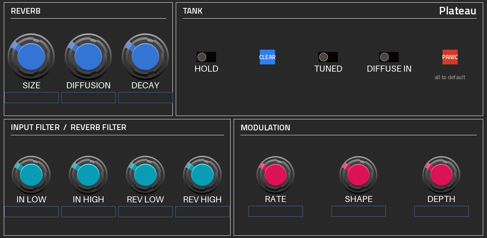
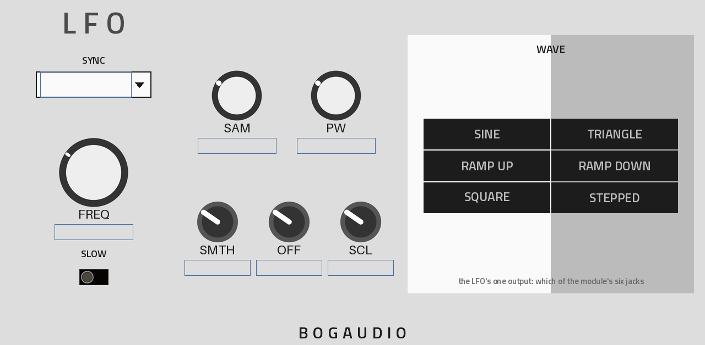
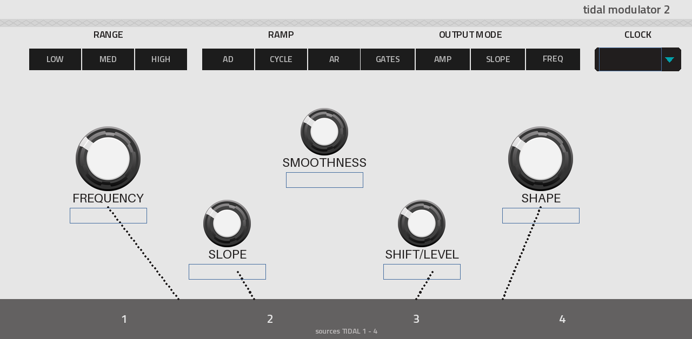
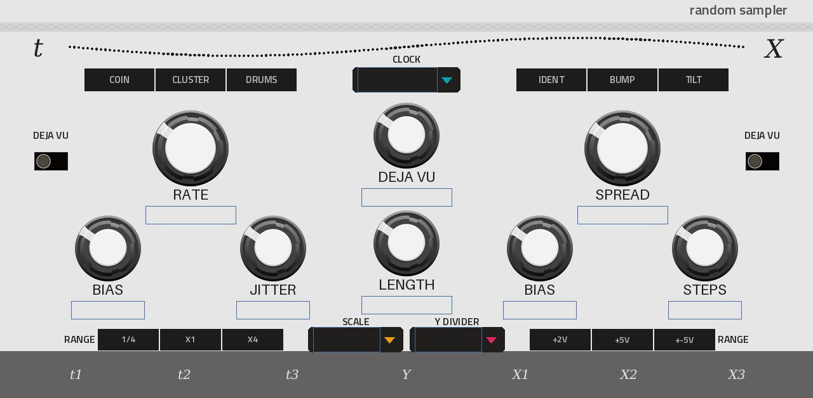
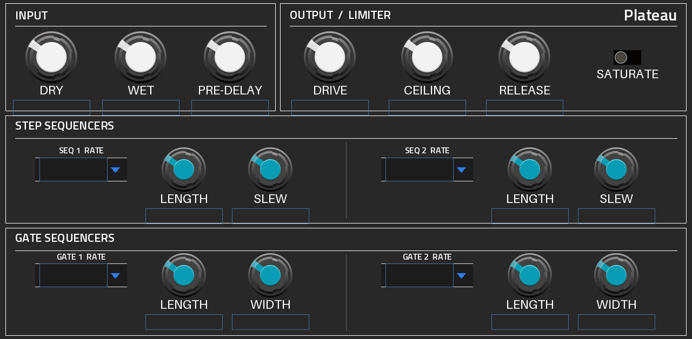
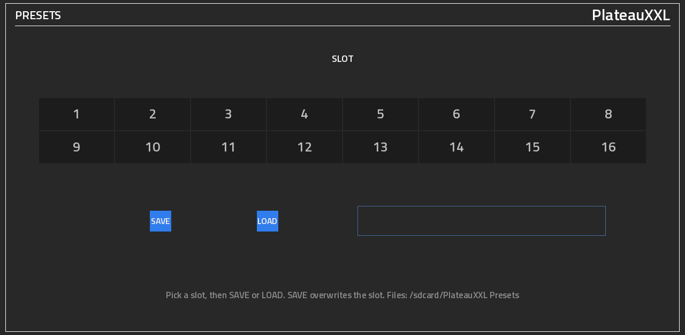
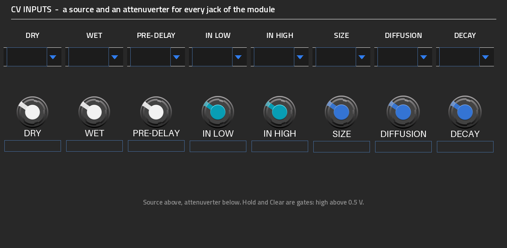

# PlateauXXL

Plateau brings Valley's plate reverb to MPC, tested on Akai Force with the latest OS and Mockba Mod. Features
Bogaudio LFO, Mutable Tides and Marbles, an in-house step sequencer, interconnected modulation routing, filtering,
saturation, RMXXXL-style limiting, presets, panic reset and full Q-Link control.

## Plateau for MPC OS

**Valley Audio's Plateau reverb, running natively inside MPC OS on the Akai Force.**

Plateau is Dale Johnson's plate reverb for VCV Rack, built on Jon Dattorro's 1997 algorithm: huge, smooth tails,
a modulated tank, Hold to freeze the tank and Clear to empty it, and a Tuned mode that turns tiny tank sizes into
resonant pitched tones. This is a port of it to a VST2 insert effect for MPC OS's built-in plugin host, made by
L'Cronx (shown on the device as **ANDREALPHEUS**), with the VCV panel's dark colours and Valley's own knobs.

On VCV Rack, Plateau comes alive through what is patched into its jacks. A Force has no cables, so this port builds
the patch in: **every CV input of the module** picks a source and has the module's own attenuverter, and the
sources are VCV favourites running inside the plugin, each on a page drawn like the module it comes from:
**Bogaudio's LFO** (four of them), **Tidal Modulator 2** and **Random Sampler** (Mutable Instruments' Tides 2 and
Marbles, as in VCV's Audible Instruments), plus two **step sequencers** and two **gate sequencers**. All of them can
follow the MPC tempo.

> [!NOTE]
> **Status: 0.4.0.** 0.3.0 was tested on an Akai Force (latest MPC OS, MockbaMod). It passes its test suite on x86
> (ASan + UBSan) and on the ARM build under QEMU. Report anything odd under [Issues](../../issues).



*The PLATEAU page, rendered offline from the skin (on the device MPC fills in the values).*

| | | |
| --- | --- | --- |
|  |  |  |
|  |  |  |

## Pages

| Page | Sub-pages | What |
| --- | --- | --- |
| PLATEAU | PLATEAU | The reverb and PANIC, in the VCV panel's dark colours and Valley's knobs |
| | IN / OUT, SEQ SET | One screen: Dry, Wet, Pre-Delay, the limiter and Saturate (IN / OUT's Q-Links); the four sequencers' Rate, Length and Slew / Width (SEQ SET's) |
| | PRESETS | 16 slots, SAVE, LOAD |
| CV IN | CV 1, CV 2 | A source and an attenuverter for each of the module's 15 CV inputs |
| LFO | LFO 1-4 | Bogaudio LFO: frequency or tempo sync, Slow, sample, pulse width, smooth, offset, scale, and which wave goes out |
| TIDAL / RANDOM | TIDAL, RANDOM 1, RANDOM 2 | Tidal Modulator 2 (Tides 2) and Random Sampler (Marbles, one screen, two Q-Link sub-pages), on light grey panels with VCV's Rogan knobs |
| SEQ | SEQ 1, SEQ 2, GATE 1, GATE 2 | Two 16-step CV sequencers (+/-5 V) and two 16-step gate sequencers |

### Q-Links

Every control is on a Q-Link, buttons and switches too, in reading order: the top row left to right, then the next
row, and so on (Q-Link 1, 2, 3, ...; 1-8 on knob bank 1, 9-16 on bank 2). A page has at most 16, so a screen with
more controls has two Q-Link sub-pages showing the same screen (IN / OUT and SEQ SET, RANDOM 1 and 2).

- **Knobs** turn as usual.
- **On/off switches** flip once per turn, either way.
- **Option lists** move one option per step, at most one every 0.2 s, so a fast turn doesn't race through them.
- **Buttons** (Clear, Panic, Save, Load) fire on a turn to the right, once per turn.

### Panic and presets

**PANIC** puts every setting back to its default, as a freshly inserted Plateau: the reverb, the CV routing, every
source and sequencer. It empties the tank and restarts the sources. Only the preset slot stays.

**Presets:** pick a slot (1-16) on PRESETS, then **SAVE** or **LOAD**. The line beside them says STORED, EMPTY,
SAVED or LOADED. A preset holds every setting. The slots are files in `/sdcard/Plateau Presets` (`Preset 01.txt` to
`Preset 16.txt`), outside the plugin folder, so they survive updates and can be copied to another device. SAVE
overwrites the slot without asking.

### Sources a CV input can pick

`LFO 1-4`, `Tidal 1-4` (the module's four outputs), `X1`, `X2`, `X3`, `Y`, `T1`, `T2`, `T3` (Random Sampler's
outputs), `Seq 1`, `Seq 2`, `Gate 1`, `Gate 2`. The voltages are the modules' own (an LFO swings +/-5 V, a gate is
10 V), and the CV math is Plateau's: for example Size moves by 0.1 per volt, Dry and Wet by the whole range per volt,
and Hold and Clear react above 0.5 V. The attenuverter (-100 % to +100 %) scales the source first. Hold also holds
while its input is high; Clear clears on a rising edge.

### Tempo

The LFOs, Tidal, Random and the sequencers follow the MPC tempo; pressing play restarts them from the top, as a reset
would. Tidal in Cycle mode locks to the tempo (Frequency then picks a ratio), and in AD or AR mode each tempo division
triggers it. Random's T clock becomes the tempo when its CLOCK is set. With "Free" they run on their own rate knobs.

## Controls (PLATEAU and IN / OUT)

| Section | Controls | Notes |
| --- | --- | --- |
| Reverb | Size, Diffusion, Decay | Size glides like the VCV knob; Tuned changes its scale |
| Input | Dry, Wet, Pre-Delay | Pre-delay up to 500 ms |
| Tank | Hold, Clear, Tuned, Diffuse In, Panic | Hold latches; Clear fades out, empties the tank, fades back in |
| Input filter / Reverb filter | In Low, In High, Rev Low, Rev High | Shown in Hz |
| Modulation | Rate, Shape, Depth | The tank's four LFOs |
| Output / Limiter | Drive, Ceiling, Release, Saturate | The module's soft output saturation, then RMXXXL's look-ahead brickwall limiter (1.45 ms latency) |


## Requirements

- An **Akai Force** (first generation). Other first-generation MPC OS units should work but are untested.
- **Root SSH access** to the device, for example through MockbaMod. Stock MPC OS can't install third-party plugins.
- **MPC OS 3.x.**

## Installation

Download `Plateau-<version>-mpc-armv7.zip` from [Releases](../../releases), or build it (below). Unzip it and follow
the `INSTALL.md` inside. In short:

```
scp -r Plateau-<version> root@<device-ip>:/tmp/
ssh -t root@<device-ip> sh /tmp/Plateau-<version>/install.sh
```

The installer asks for confirmation (`-y` skips it), **stops MPC** (save your project first), copies the plugin to
`/sdcard/Synths/ANDREALPHEUS - VST - Plateau/`, backs up and edits `MPC.settings`, and starts MPC again. Then insert
**Plateau** (manufacturer ANDREALPHEUS) on a track, submix or the master. `uninstall.sh` removes it the same way.

## Building

Linux or WSL with Python 3, gcc and [Zig](https://ziglang.org/) (`pip install ziglang pillow cairosvg`), and the
DejaVu fonts. No Docker.

```
git clone --recursive https://github.com/sunskiefer/PlateauXXL
cd PlateauXXL
./build.sh                # build/arm/plateau.so + the skin -> build/package/
test/run_tests.sh         # the framework's host test + the sources' and the reverb's tests, under ASan/UBSan
```

`tools/gen_params.py` is the single source of the parameter list (it writes `params.json` and `src/param_ids.h`).
MPC stores automation by parameter index, so parameters are appended only, never reordered.

## Roadmap

See [ROADMAP.md](ROADMAP.md).

## License

GNU GPL v3.0 or later ([LICENSE](LICENSE)), as the Plateau DSP it includes. Third-party parts keep their own
licences (below). The knob artwork includes VCV Component Library graphics (CC BY-NC 4.0), so the plugin is free and
must not be sold.

## Credits

- **Plateau:** Dale Johnson, [Valley Audio](https://github.com/ValleyAudio/ValleyRackFree) (GPL-3.0-or-later),
  after J. Dattorro, "Effect Design Part 1", J. Audio Eng. Soc. 45(9), 1997. The DSP is vendored unchanged in
  `third_party/valley` ([VENDORED.md](third_party/valley/VENDORED.md)).
- **LFO:** Matt Demanett, [Bogaudio](https://github.com/bogaudio/BogaudioModules) (GPL-3.0-or-later); the DSP
  library is vendored unchanged in `third_party/bogaudio` ([VENDORED.md](third_party/bogaudio/VENDORED.md)).
- **Tidal Modulator 2 and Random Sampler:** Emilie Gillet, Mutable Instruments Tides 2 and Marbles (MIT), from VCV's
  fork of the eurorack code, vendored unchanged in `third_party/mutable`
  ([VENDORED.md](third_party/mutable/VENDORED.md)); module glue after VCV
  [Audible Instruments](https://github.com/VCVRack/AudibleInstruments) (GPL-3.0-or-later).
- **Knob artwork:** Valley's Rogan knobs (ValleyRackFree), VCV's Rogan knobs (VCV Component Library, CC BY-NC 4.0)
  and Bogaudio's knobs (CC BY-SA 4.0); see [art/README.md](art/README.md).
- **VST2 wrapper, skin generator, installer:** sd88me ([mpc-vst-plugins](https://github.com/sd88me/mpc-vst-plugins))
  (MIT), as a submodule in `third_party/mpc-vst-plugins`.
- **Interface font:** [Titillium Web](https://fonts.google.com/specimen/Titillium+Web), SIL Open Font License 1.1
  (`art/fonts/OFL.txt`).

Not affiliated with or endorsed by Valley Audio, Bogaudio, Mutable Instruments, VCV or Akai Professional.
